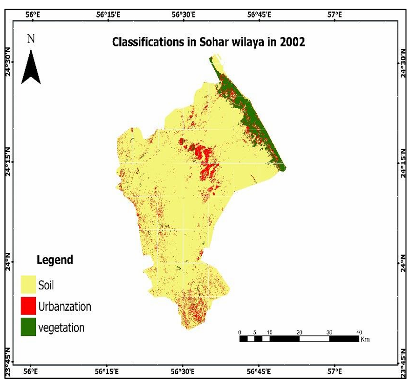
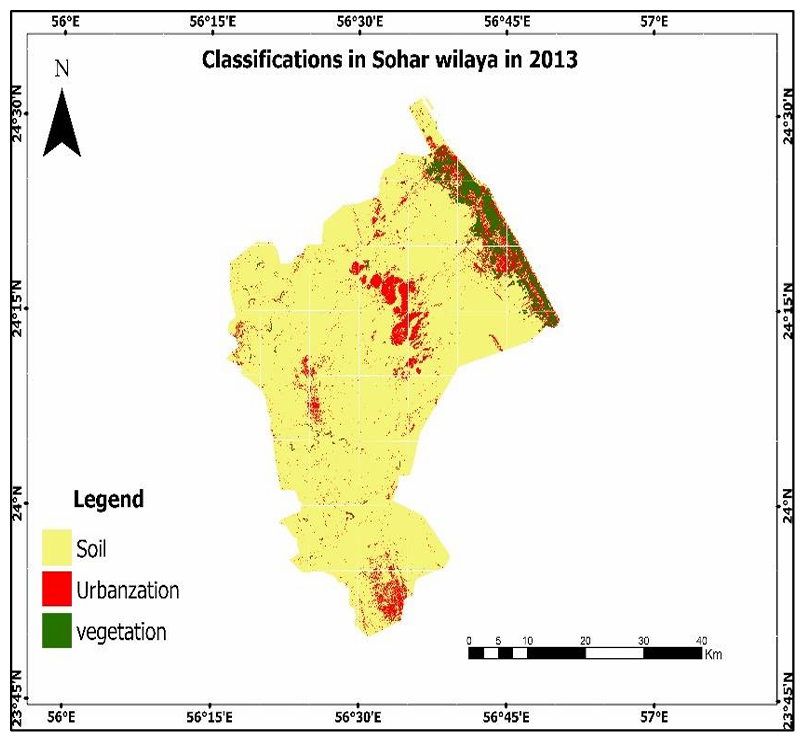
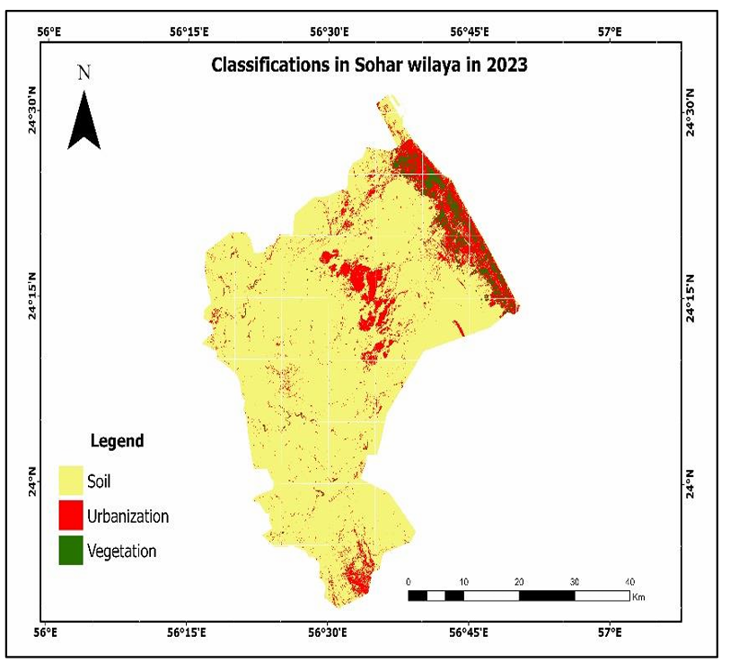
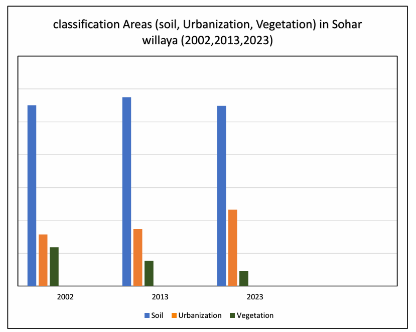
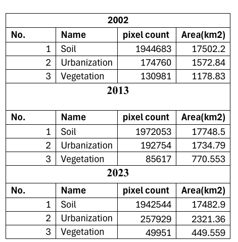

# 🌿 Vegetation Cover & Urban Growth Analysis – Al Batinah (2002–2023)

## 📌 Overview
This project analyzes the relationship between vegetation cover change and urban expansion in Al Batinah region, Oman, from 2002 to 2023 using GIS and remote sensing techniques.

---

## 🎯 Objectives
- Analyze vegetation cover changes over time  
- Identify urban expansion patterns  
- Explore the relationship between vegetation loss and urban growth  

---

## 🛠️ Tools & Data
- ArcGIS Pro  
- Map Algebra  
- FME  
- Satellite Data  

---

## 🧠 Methodology
1. Data collection and preprocessing  
2. Classification of land cover (vegetation, urban, others)  
3. Spatial analysis using GIS tools  
4. Comparison between years (2002, 2013, 2023)  
5. Visualization using maps and charts  

---

## 📊 Results
- Significant urban expansion observed in Al Batinah - Sohar
- Noticeable decrease in vegetation areas  
- Strong spatial correlation between urban growth and vegetation loss  

---

## 🗺️ Maps & Outputs
### Vegetation Classification Maps

  
  

---

### 📈 Change Analysis

---

### 📋 Data Table

---

## 📍 Study Area
Al Batinah, Oman  

---

## 👩‍💻 Author
Shahd Al Abdali  
GIS & Remote Sensing
